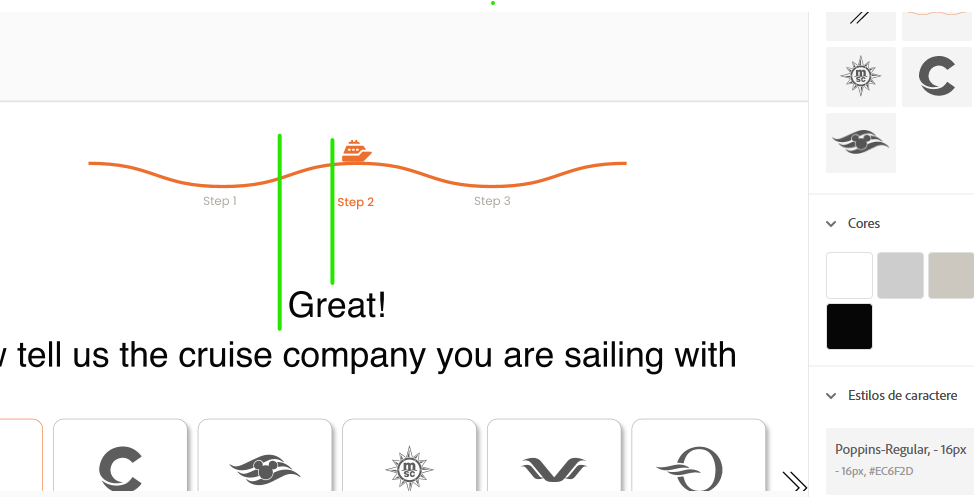

# Wizard Project

This is a project built purely in html, css and javascript. It is a responsible developtment by Karine Amorim.

## About the process

1. The ZillaSlab font was used with serif differently of the design provided. I didn't find on GoogleFonts or other sites the sans-serif version.

2. All logos - except royal-caribbean - seem to be lighter in comparison with the mentioned exception. But as long as i tried to change it by code, it didn't work.

3. I undertood wrongly that Tiny Slider JS Library was optional, so I didn't use as long as i didn't find it necessary. As that was a simple implementation it went fastly well. Still, i would like to apologize for this misunderstanding.

4. Finally, i would like to let an observation since there is a peculiar alignment that make me uncomfortable. I am not sure if that was on purpose, therefore I thought it would be worth to mention. Important to highliht that the project is just as the design.

## 

* This is the alignment mentioned in the item 3. This printscreen is from the Abode Design previously provided.

## Run this project

To run this project:

1. Donwload the project.
2. If you donwload the zip, make sure to extract it.
3. Open a navigate guide.
4. Pressure Ctrl + O and find the index.html of this project.
5. When you click to open this index.html, the project will be started in the guide.

## Acknowledgements

I couldn't forget to thank you for this opportunity and for trusting in my potential. I feel really grateful for it, and wish you the best luck about all the exciting projects you presented me.